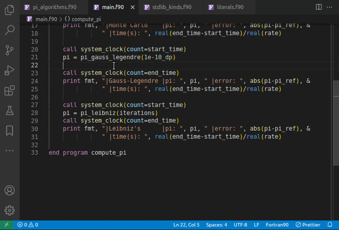
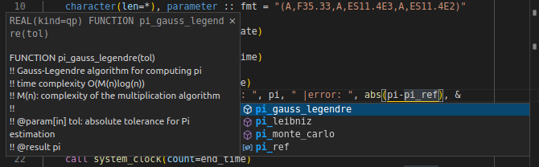
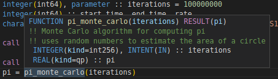
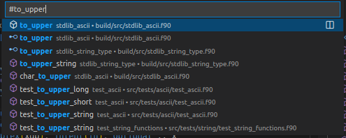
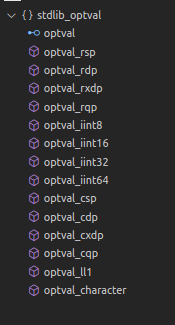
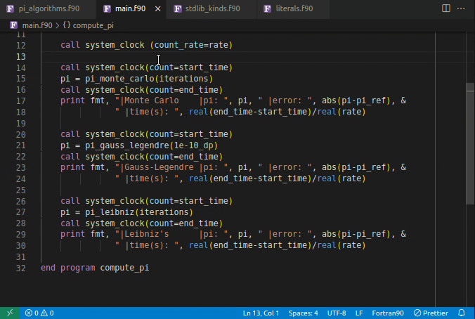
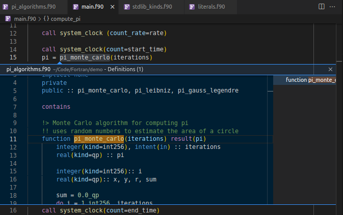
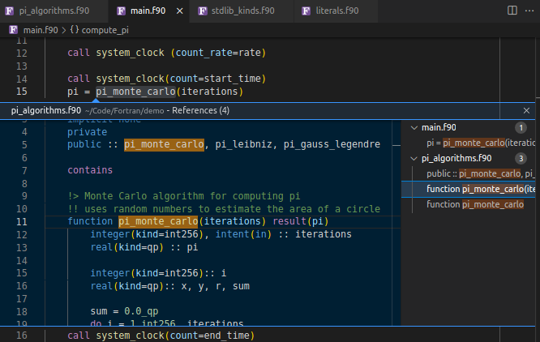
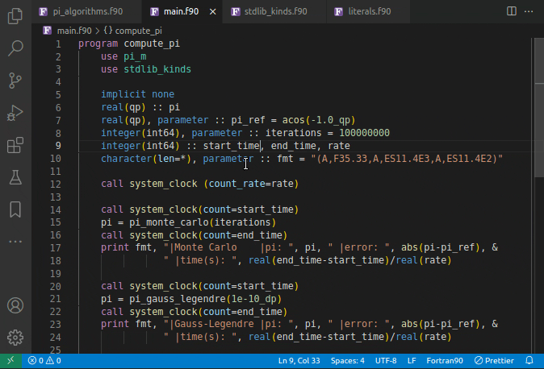

Features
===============

- Project-wide and Document symbol detection and Renaming
- Hover support, Signature help and Auto-completion
- GoTo/Peek implementation and Find/Peek references
- Preprocessor support
- Documentation parsing `Doxygen <http://www.doxygen.org/>`__ and `FORD <https://github.com/Fortran-FOSS-Programmers/ford>`__ styles
- Diagnostics
- Code actions
- Intrinsics modules

Completion
----------

Hover
-------

.. image:: ../assets/lsp/hover2.png

Symbols
------------

Project-wide and single Document symbol search

Signature Help
----------------

.. image:: ../assets/lsp/sig-help.gif

Find References
------------------

    *Go To Definition of a function*

    *Peek into the Definition of a function*

    *Peek into all the References of a function*

Renaming
------------

    *Rename a variable*

Diagnostics
-------------

- Multiple definitions with the same variable name
- Variable definition masks definition from parent scope
- Missing subroutine/function arguments
- Unknown user-defined type used in ``TYPE``/ ``CLASS`` definition (only if visible in project)
- Unclosed blocks/scopes
- Invalid scope nesting
- Unknown modules in ``USE`` statement
- Unimplemented deferred type-bound procedures
- Use of non-imported variables/objects in interface blocks
- Statement placement errors (``CONTAINS``, ``IMPLICIT``, ``IMPORT``)

Code Actions
---------------

- Generate type-bound procedures and implementation templates for deferred procedures

Intrinsics Modules
------------------

- ``ISO_FORTRAN_ENV``, ``ISO_C_BINDING`` GCC 11.2.0
- ``IEEE_EXCEPTIONS``, ``IEEE_ARITHMETIC``, ``IEEE_FEATURES`` GCC 11.2.0
- OpenMP ``OMP_LIB``, ``OMP_LIB_KINDS`` v5.0
- OpenACC ``OPENACC``, ``OPENACC_KINDS`` v3.1

All LSP Requests
--------------------

.. list-table:: tmp
    :header-rows: 1

    *   - Request
        - Description
    *   - ``workspace/symbol``
        - Get workspace-wide symbols
    *   - ``textDocument/documentSymbol``
        - Get document symbols e.g. functions, subroutines, etc.
    *   - ``textDocument/completion``
        - Suggested tab-completion when typing
    *   - ``textDocument/signatureHelp``
        - Get signature information at a given cursor position
    *   - ``textDocument/definition``
        - GoTo definition/Peek definition
    *   - ``textDocument/references``
        - Find all/Peek references
    *   - ``textDocument/documentHighlight``
        - Same as ``textDocument/references``
    *   - ``textDocument/hover``
        - Show messages and signatures upon hover
    *   - ``textDocument/implementation``
        - GoTo implementation/Peek implementation
    *   - ``textDocument/rename``
        - Rename a symbol across the workspace
    *   - ``textDocument/didOpen``
        - Document synchronisation upon opening
    *   - ``textDocument/didSave``
        - Document synchronisation upon saving
    *   - ``textDocument/didClose``
        - Document synchronisation upon closing
    *   - ``textDocument/didChange``
        - Document synchronisation upon changes to the document
    *   - ``textDocument/codeAction``
        - **Experimental** Generate code
